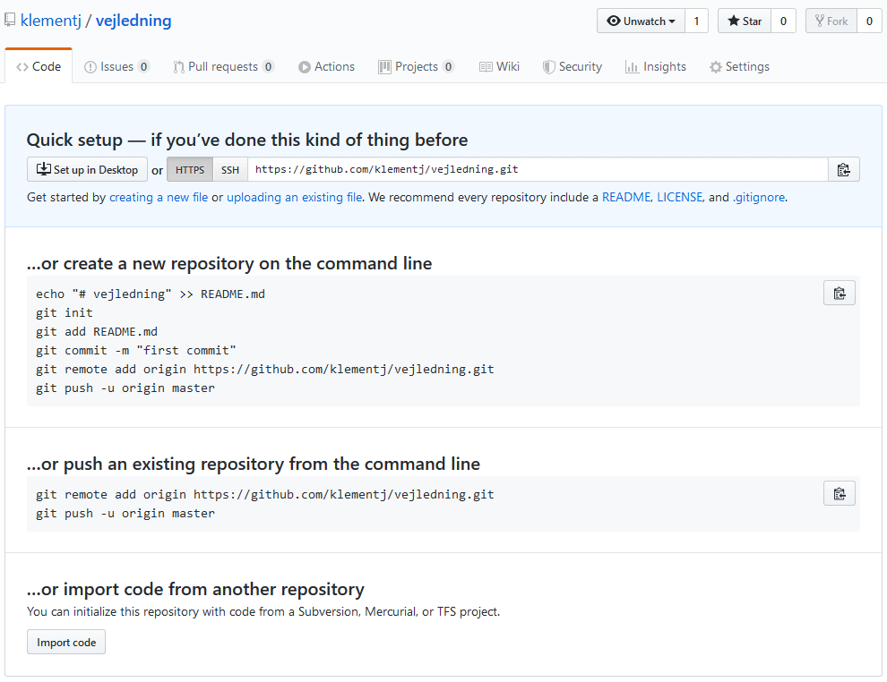

# Oprette repository på GitHub
Vejledning til at oprette et remote repository på GitHub og gøre dette til origin på det lokale repository.

## Oprette repository på GitHub

1. Gå ind på github, tryk på det lille plus og herefter på 'New Repository'. 
    
    Alternativt kan du gå direkte ind på [github.com/new](https://github.com/new)

2. Giv dit repository et navn og tryk på 'Create Repository'
3. Dit repository er nu oprettet. Hvis du endnu ikke har oprettet et lokalt git repository med `git init` så vejleder GitHub i den første vejledning hvordan du kan:

    3.1 Oprette en README.md fil med en overskrift
    
    3.2 Initializere et lokalt repository med `git init`
    
    3.3 Tilføje README.md til staging area med `git add README.md`
    
    3.4 Committer til tilføjelsen med `git commit -m "first commit"`

    I første modul oprettede vi et lokalt repository og tilføjede filer som vi committede os til. Det er derfor kun de to sidste linjer vi skal forholde os til.

    3.5 Åben det lokale repository i terminal

    3.6 Tilføj navn og url til det nu oprettede remote repository på Github med `git remote add origin <url til .git repo>.git`

    3.7 Push lokale ændringer op til remote med `git push -u origin main`. Det er navnet på remote repo efterfulgt af hvilken branch.

