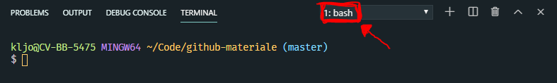

# Introduktion
Materialet i dette repository introducere til git og GitHub med vejledninger, præsentation og opgaver. Du kommer gennem hvordan du installerer og sætter git op på din computer. Hvordan du laver dit første repository, opretter og tilføjer filer, forpligter dig til ændringer. Du lærer hvordan du kan ligge dit repository på GitHub. Til sidst prøver du at lave en branch.

For at komme igang skal du starte med at installere og opsætte git på din computer.

## For at komme igang

1. Registre en konto på [GitHub](www.github.com)
2. [Download og installer git](https://git-scm.com/)
3. Opsæt VS Code til at bruge Git Bash som standard

    3.1 Åben VS Code

    3.2 Vis `Command Palette` (Ctrl + Shift + P)

    3.3 Begynd at skrive `default shell` og vælg kommandoen `Terminal: Select Default Shell` når den kommer frem

    3.4 Vælg `Git Bash`

    3.5 Åben din terminal i VS Code (Ctrl + æ) og tjek at den bruger `bash` 
        
    

    Brug `Bash` i VS Code fordi det virker bedre med copy/paste genveje. Genvejen for for paste er fx Shift + INS i Git Bash uden for VS Code

4. Opsæt git med det rigtige brugernavn og email ved at skrive:
``` bash
$ git config --global user.name "FirstName LastName"
$ git config --global user.email "email@example.com"
```
Dette er vigtigt fordi git bruger disse oplysninger når du arbejder på et projekt.

## Begreber

Repository

## Videre læsning

[Guide til at skrive gode commit beskeder](https://chris.beams.io/posts/git-commit/)

[GitHub education cheat sheet](https://education.github.com/git-cheat-sheet-education.pdf)

[An interactive git cheat sheet from NPD Software](https://ndpsoftware.com/git-cheatsheet.html)